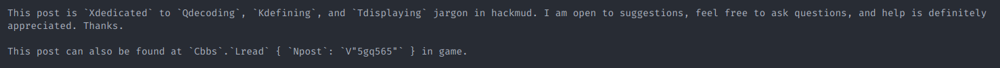
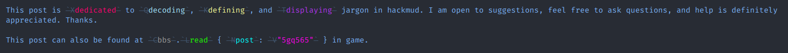

# hackmud-color README
Colours strings as they appear in game, and colours plaintext as it appears on the forums.

Before:

After:

## Features
- Obscures text that won't be seen in game.
- Only colours strings in code files (JavaScript and TypeScript).
- Colours whole document in plaintext files.

## Commands
Adds 2 commands `Hackmud Color: Enable` and `Hackmud Color: Disable` which enable and disable the extension on the fly.

## Extension Settings

Adds `hackmud-color.enable` which enables or disables the extension.

## Known Issues
There are no known issues which means this extension is perfect (or issues havn't been discovered yet - post an issue if you spot something).
